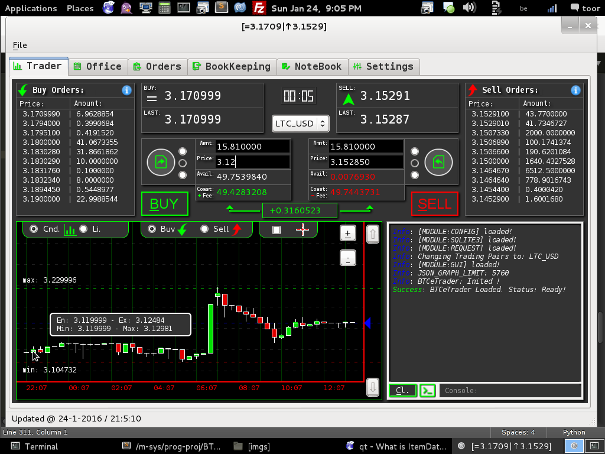
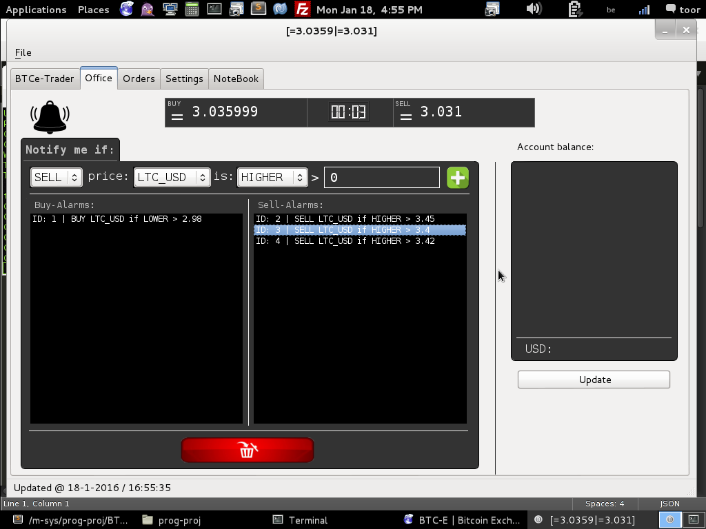
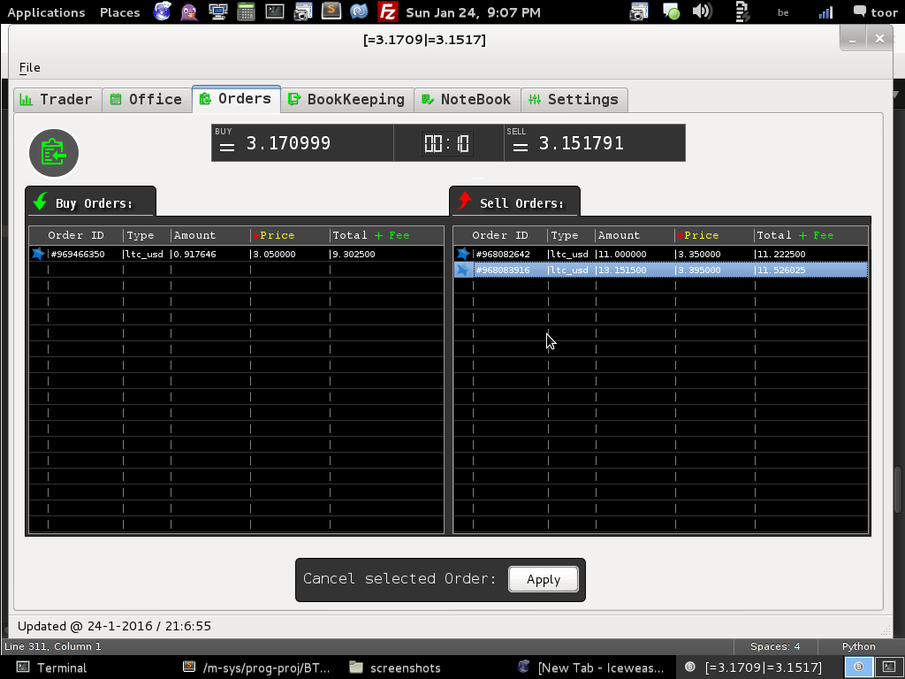
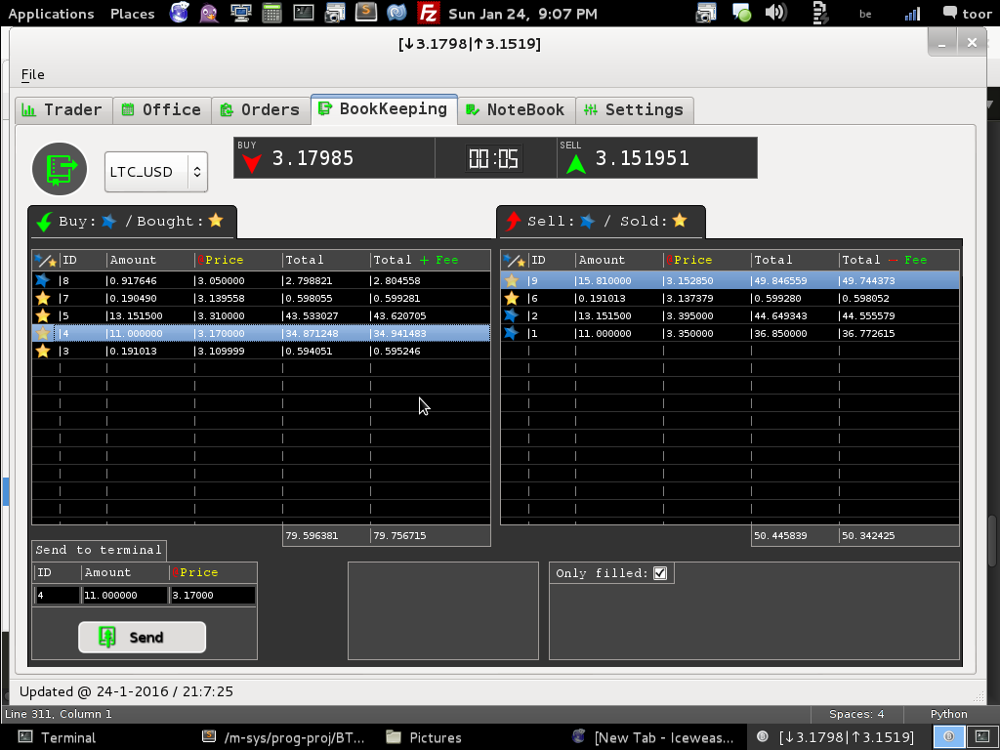
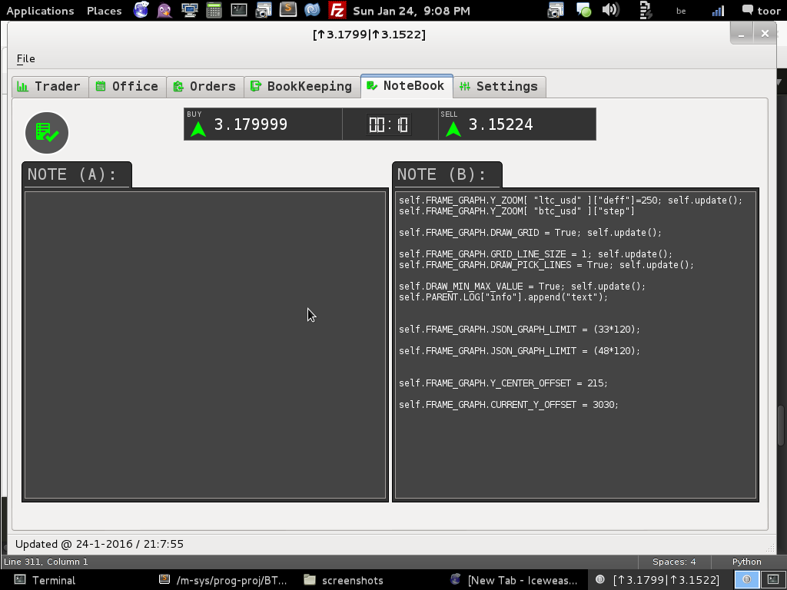

-----
#### BTCeTrader -> Open-Source Cross-Platform <BTC-e.com> Trading Terminal!
-----


### WARNING !!! 
#### Is still in active development [v-ALPHA]. Use it on your own risk!

-----

```javascript
Version     : ["BTC-e-Trader", "v 0.0.1a"];
Powered by  : ["Python2.7", "PyQt4"]
Supported   : ["GNU-Linux", "Mac-OS", "Windows"];

PyQt4       : ["Full-Documentation", "http://pyqt.sourceforge.net/Docs/PyQt4/classes.html"];
Python      : ["Project-HomePage", "http://python.org"];

```

-----
#####  Requirements:

- [x] [required]:
    * python-qt4 - Python bindings for Qt4
    * python2.7  - Full-Python environment
    
- [ ] [optional]:
    * mpg123     - Media-Player
    * python-qt4-doc


-----

##### Implemented: 

- [x] [1] Monitoring: without PUBLIC/PRIVATE keys
- [x] [2] Trading ( add/cancel orders ) in multi-currency: provide yours PUBLIC/PRIVATE keys
- [x] [3] Trading-Assistance: alarms/notifications [done]
- [x] [4] Live-Currency-Graph-Plotter: Classic Candles/Lines
- [x] [5] Calculator On-The-Fly: Will execute live calculations based on user input
- [x] [6] Order-Checker.  Will check for completed Orders and notify (Text and sound notifications)

-----
##### Almost Implemented:

- [x] Built-in bookkeeping. Very use-full tool.


-----
##### Not Implemented:

- [ ] Graph Plotters based on File/Data-Base from the past. So it can plot cool graphics with very use-full statistic.
- [ ] Half/Full Auto-Trader. Trading based on user predefined parameters.
- [ ] Web Interface: Same functionality and design
- [ ] Maybe more in the future.

-----
##### To use it As TradeTerminal:

Open config-file: "BTCeTrader/data/config/BTCeTrader.json" and add your keys!

```javascript
//  "/data/config/BTCeTrader.json"

"KEY" : {
    "PUB" : " PUBLIC-KEY ",
    "SEC" : " PRIVATE-KEY "
}

```

-----
##### Disable-Sound-FX

If you don't want sounds: Open a conf file "./data/config/BTCeTrader.json" and change

*Text notifications will still be available!*

```javascript

"ALLOW_SOUND"       : true // no-sound -> only text notif.
"ALLOW_SOUND"       : false // text & sound notif.

```


-----
## Tab-Trader:



-----
## Tab-Office:



-----
## Tab-Orders:


-----
## Tab-BookKeeping:


-----
## Tab-NoteBook:


-----

# BTCeTrader
